

  

<table align="center" bgcolor="#0E0F18" cellspacing="0" cellpadding="0" border="0">
  <tr>
    <td colspan="3" valign="top" align="left">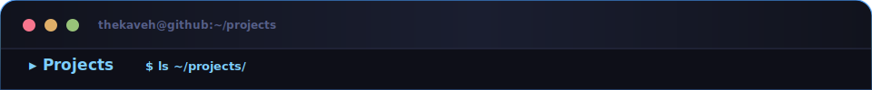</td>
  </tr>
  <tr>
    <td valign="top" align="left"><a href="https://github.com/thekaveh/genai-vanilla">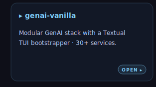</a></td>
    <td valign="top" align="left"><a href="https://github.com/thekaveh/GuideArch">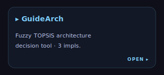</a></td>
    <td valign="top" align="left"><a href="https://github.com/thekaveh/NNx">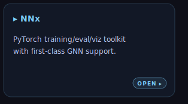</a></td>
  </tr>
  <tr>
    <td valign="top" align="left"><a href="https://github.com/thekaveh/VMx">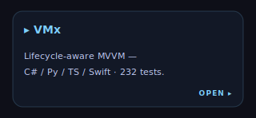</a></td>
    <td valign="top" align="left"><a href="https://github.com/thekaveh/ml-lab">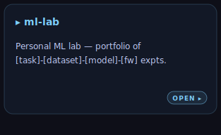</a></td>
    <td valign="top" align="left">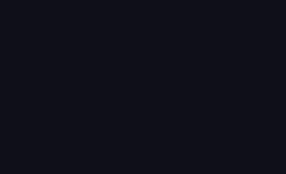</td>
  </tr>
  <tr>
    <td colspan="3" valign="top" align="left"></td>
  </tr>
</table>

  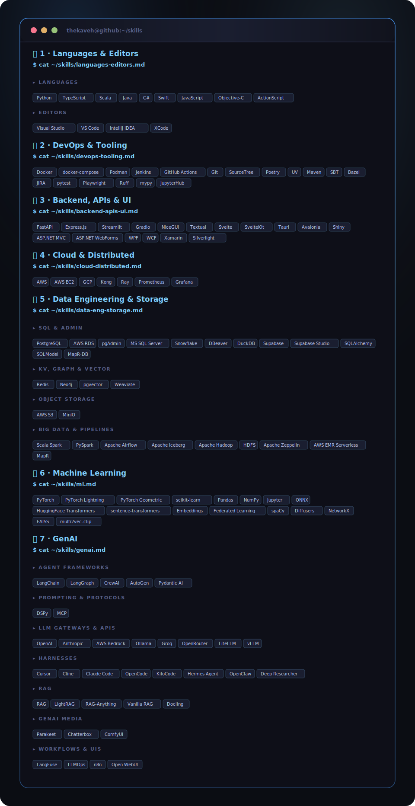

<table align="center" bgcolor="#0E0F18" cellspacing="0" cellpadding="0" border="0">
  <tr>
    <td colspan="3" valign="top" align="left">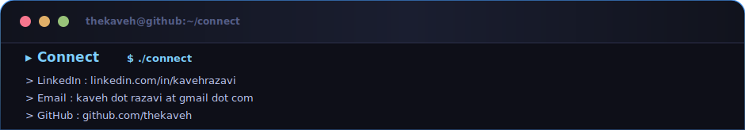</td>
  </tr>
  <tr>
    <td valign="top" align="left"><a href="https://linkedin.com/in/kavehrazavi">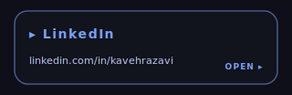</a></td>
    <td valign="top" align="left"><a href="mailto:kaveh.razavi@gmail.com">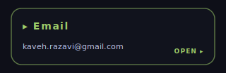</a></td>
    <td valign="top" align="left"><a href="https://github.com/thekaveh">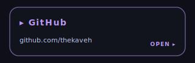</a></td>
  </tr>
  <tr>
    <td colspan="3" valign="top" align="left"></td>
  </tr>
</table>

<!-- terminal profile · Tokyo Night palette · GenAI-Vanilla LOGO_GRADIENT hero · generated for thekaveh -->
