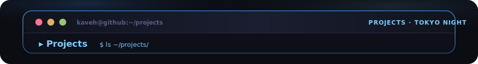
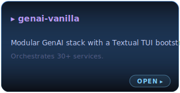
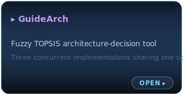
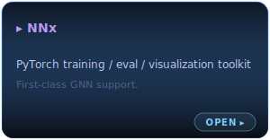
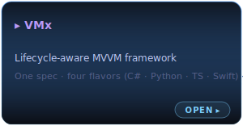
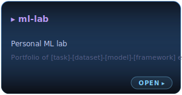

  

  

<table align="center" cellspacing="12" cellpadding="0" border="0">
  <tr>
    <td align="center" valign="top"></td>
    <td align="center" valign="top"></td>
    <td align="center" valign="top"></td>
  </tr>
  <tr>
    <td align="center" valign="top"></td>
    <td align="center" valign="top"></td>
    <td>&nbsp;</td>
  </tr>
</table>

  

  

  
  &nbsp;
  
  &nbsp;
  

<!-- terminal profile · Tokyo Night palette · GenAI-Vanilla LOGO_GRADIENT hero · generated for kavehrazavi -->
