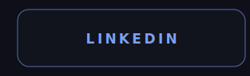
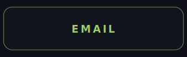
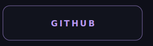

  

<table align="center" cellspacing="0" cellpadding="0" border="0">
  <tr>
    <td colspan="3"></td>
  </tr>
  <tr>
    <td></td>
    <td></td>
    <td></td>
  </tr>
  <tr>
    <td></td>
    <td></td>
    <td></td>
  </tr>
  <tr>
    <td colspan="3"></td>
  </tr>
</table>

  

<table align="center" cellspacing="0" cellpadding="0" border="0">
  <tr>
    <td colspan="3"></td>
  </tr>
  <tr>
    <td></td>
    <td></td>
    <td></td>
  </tr>
  <tr>
    <td colspan="3"></td>
  </tr>
</table>

<!-- terminal profile · Tokyo Night palette · GenAI-Vanilla LOGO_GRADIENT hero · generated for thekaveh -->
